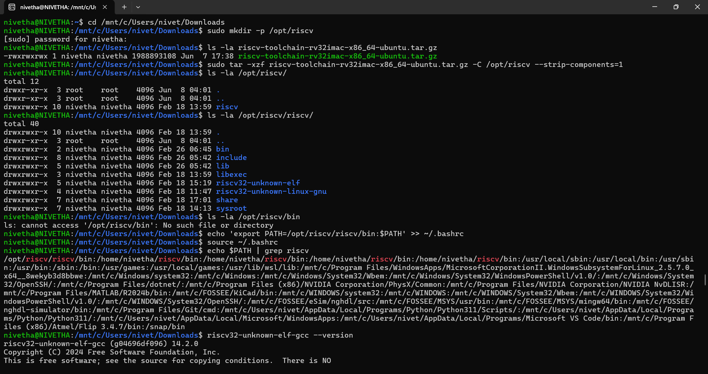
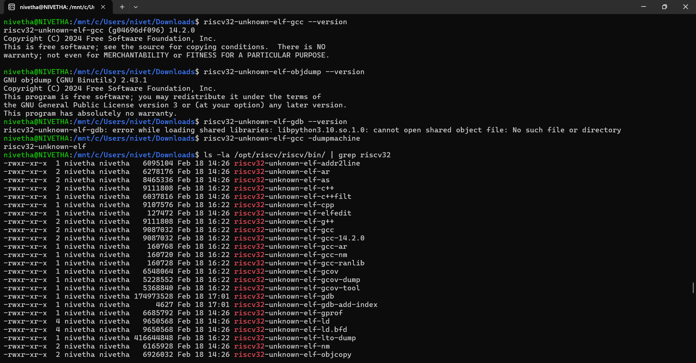
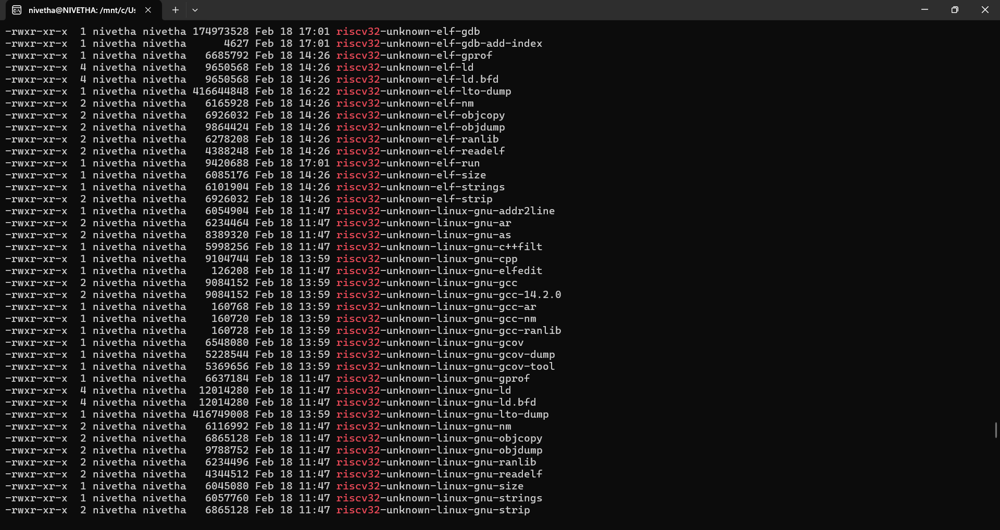

# 🛠️ Task 1: RISC-V Toolchain Setup and Verification Using WSL

## 🎯 Objective

Successfully install the RISC-V toolchain in WSL (Windows Subsystem for Linux), configure environment variables, and verify that the essential binaries (`gcc`, `objdump`) function correctly for cross-compilation development.

---

## 📋 Prerequisites

✅ WSL installed and configured  
✅ Basic Linux command line knowledge  

---

## 📥 Toolchain Download

We have first downloaded the RISC-V toolchain archive from:

👉 https://vsd-labs.sgp1.cdn.digitaloceanspaces.com/vsd-labs/riscv-toolchain-rv32imac-x86_64-ubuntu.tar.gz

Saved it to the Windows Downloads directory:

`/mnt/c/Users/nivet/Downloads`

---

## 🚀 Step-by-Step Implementation

---

### Step 1: Navigate to Downloads Directory and Create Installation Path

```bash
cd /mnt/c/Users/nivet/Downloads
sudo mkdir -p /opt/riscv
ls -la riscv-toolchain-rv32imac-x86_64-ubuntu.tar.gz
```


### Step 2: Extract the RISC-V Toolchain

```bash
sudo tar -xzf riscv-toolchain-rv32imac-x86_64-ubuntu.tar.gz -C /opt/riscv --strip-components=1
ls -la /opt/riscv/
ls -la /opt/riscv/riscv/
```
### Step 3: Configure PATH Environment Variable

```bash
echo 'export PATH=/opt/riscv/riscv/bin:$PATH' >> ~/.bashrc
source ~/.bashrc
echo $PATH | grep riscv
```

### Step 4: Verify Toolchain Installation

```bash
riscv32-unknown-elf-gcc --version
riscv32-unknown-elf-objdump --version
riscv32-unknown-elf-gcc -dumpmachine
ls -la /opt/riscv/riscv/bin/ | grep riscv32
```
---
---

## 📊 Expected Results

- **GCC version:** riscv32-unknown-elf-gcc (g04696df096) 14.2.0  
- **Objdump version:** GNU objdump (GNU Binutils) 2.43.1  
- **Target architecture:** riscv32-unknown-elf  
- **Binaries verified:** riscv32-unknown-elf-gcc, riscv32-unknown-elf-objdump, and other essential tools inside `/opt/riscv/riscv/bin/`

---

## 📸 Implementation Output

_(Include my terminal output screenshot below)_





---
# 🏗️ Task 2: Cross-Compile "Hello, RISC-V"

## 🎯 Objective

Create a minimal C "Hello World" program and successfully cross-compile it for the RISC-V RV32 architecture, producing a valid 32-bit RISC-V ELF executable.

## 📋 Prerequisites

✅ RISC-V toolchain installed and configured (Task 1 completed)  
✅ PATH environment variable set to `/opt/riscv/riscv/bin`  
✅ Verified `riscv32-unknown-elf-gcc` functionality  
✅ Basic knowledge of C programming and cross-compilation  

## 🚀 Step-by-Step Implementation

### Step 1: Create the Hello World C Program

```bash
nano hello.c
```
### C Program
```
#include <stdio.h>

int main() {
    printf("Hello, RISC-V!\n");
    return 0;
}
```
### Step 2: Cross-Compile the Hello World C Program

Use the RISC-V GCC toolchain to compile the program into a RISC-V ELF executable:

```bash
riscv32-unknown-elf-gcc -o hello.elf hello.c
```
### Step 3: Verify the Compiled ELF Binary

Check the type and architecture of the compiled binary using the `file` command:

```bash
file hello.elf
```
### Step 4: Additional Verification Commands

1. List the compiled binary file with detailed info:

```bash
ls -la hello.elf
```
2. Verify target architecture of the toolchain used
```bash
riscv32-unknown-elf-gcc -dumpmachine
```
3.Inspect ELF section headers using objdump
```bash
riscv32-unknown-elf-objdump -h hello.elf
```
### 📊 Expected Result:
✅The hello.elf file is confirmed as a 32-bit RISC-V executable.
✅The toolchain target architecture is correctly set as riscv32-unknown-elf.
✅The ELF sections (.text, .rodata, .data, etc.) are visible and correctly formatted.
✅The executable is statically linked and supports RVC instructions.
---
## 📸 Implementation Output

_(Include my terminal output screenshot below)_


---


