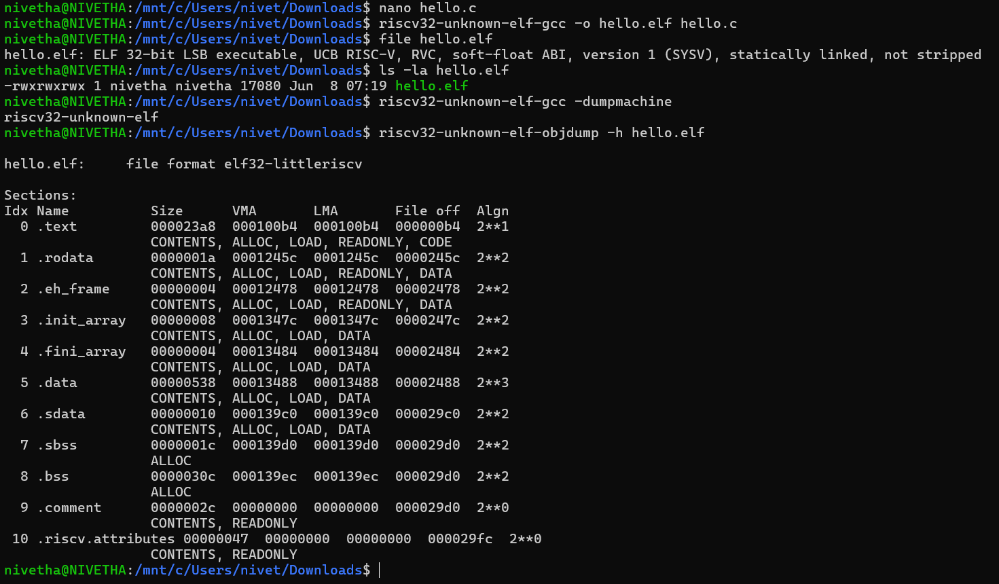

# 🛠️ Task 1: RISC-V Toolchain Setup and Verification Using WSL

## 🎯 Objective

Successfully install the RISC-V toolchain in WSL (Windows Subsystem for Linux), configure environment variables, and verify that the essential binaries (`gcc`, `objdump`) function correctly for cross-compilation development.

---

## 📋 Prerequisites

✅ WSL installed and configured  
✅ Basic Linux command line knowledge  

---

## 📥 Toolchain Download

We have first downloaded the RISC-V toolchain archive from:

👉 https://vsd-labs.sgp1.cdn.digitaloceanspaces.com/vsd-labs/riscv-toolchain-rv32imac-x86_64-ubuntu.tar.gz

Saved it to the Windows Downloads directory:

`/mnt/c/Users/nivet/Downloads`

---

## 🚀 Step-by-Step Implementation

---

### Step 1: Navigate to Downloads Directory and Create Installation Path

```bash
cd /mnt/c/Users/nivet/Downloads
sudo mkdir -p /opt/riscv
ls -la riscv-toolchain-rv32imac-x86_64-ubuntu.tar.gz
```


### Step 2: Extract the RISC-V Toolchain

```bash
sudo tar -xzf riscv-toolchain-rv32imac-x86_64-ubuntu.tar.gz -C /opt/riscv --strip-components=1
ls -la /opt/riscv/
ls -la /opt/riscv/riscv/
```
### Step 3: Configure PATH Environment Variable

```bash
echo 'export PATH=/opt/riscv/riscv/bin:$PATH' >> ~/.bashrc
source ~/.bashrc
echo $PATH | grep riscv
```

### Step 4: Verify Toolchain Installation

```bash
riscv32-unknown-elf-gcc --version
riscv32-unknown-elf-objdump --version
riscv32-unknown-elf-gcc -dumpmachine
ls -la /opt/riscv/riscv/bin/ | grep riscv32
```
---
---

## 📊 Expected Results

- **GCC version:** riscv32-unknown-elf-gcc (g04696df096) 14.2.0  
- **Objdump version:** GNU objdump (GNU Binutils) 2.43.1  
- **Target architecture:** riscv32-unknown-elf  
- **Binaries verified:** riscv32-unknown-elf-gcc, riscv32-unknown-elf-objdump, and other essential tools inside `/opt/riscv/riscv/bin/`

---

## 📸 Implementation Output

_(Include my terminal output screenshot below)_


---
# 🏗️ Task 2: Cross-Compile "Hello, RISC-V"

## 🎯 Objective

Create a minimal C "Hello World" program and successfully cross-compile it for the RISC-V RV32 architecture, producing a valid 32-bit RISC-V ELF executable.

## 📋 Prerequisites

✅ RISC-V toolchain installed and configured (Task 1 completed)  

✅ PATH environment variable set to `/opt/riscv/riscv/bin`  

✅ Verified `riscv32-unknown-elf-gcc` functionality  

✅ Basic knowledge of C programming and cross-compilation  

## 🚀 Step-by-Step Implementation

### Step 1: Create the Hello World C Program

```bash
nano hello.c
```
### C Program
```
#include <stdio.h>

int main() {
    printf("Hello, RISC-V!\n");
    return 0;
}
```
### Step 2: Cross-Compile the Hello World C Program

Use the RISC-V GCC toolchain to compile the program into a RISC-V ELF executable:

```bash
riscv32-unknown-elf-gcc -o hello.elf hello.c
```
### Step 3: Verify the Compiled ELF Binary

Check the type and architecture of the compiled binary using the `file` command:

```bash
file hello.elf
```
### Step 4: Additional Verification Commands

1. List the compiled binary file with detailed info:

```bash
ls -la hello.elf
```
2. Verify target architecture of the toolchain used
```bash
riscv32-unknown-elf-gcc -dumpmachine
```
3.Inspect ELF section headers using objdump
```bash
riscv32-unknown-elf-objdump -h hello.elf
```
### 📊 Expected Result:
✅The hello.elf file is confirmed as a 32-bit RISC-V executable.
✅The toolchain target architecture is correctly set as riscv32-unknown-elf.
✅The ELF sections (.text, .rodata, .data, etc.) are visible and correctly formatted.
✅The executable is statically linked and supports RVC instructions.

## 📸 Implementation Output

_(Include my terminal output screenshot below)_



---
# 🏗️ Task 3: From C to Assembly
## 🎯 Objective
Generate the .s file (assembly output) from the C source code and analyze the function prologue and epilogue in the main function to understand how the compiler sets up and tears down a stack frame in RISC-V.

## 📋 Prerequisites
✅ RISC-V toolchain installed and configured
✅ PATH environment variable set
✅ Completed Task 2 (have a working hello.c file)

## 🚀 Step-by-Step Implementation
### Step 1: Generate the Assembly .s file
```bash
riscv32-unknown-elf-gcc -S -O0 hello.c
```
✅ This command generates the file hello.s in the current directory.
### Step 2: Verify the Generated Assembly File
```bash
ls -la hello.s
cat hello.s
nl hello.s
```
✅ The hello.s file contains human-readable RISC-V assembly code.
✅The nl hello.s will print the hello.s file with line numbers
### 📝 Explanation of Prologue and Epilogue
 #### Function Prologue (at the start of main):
```
addi    sp,sp,-16      # Adjust stack pointer to allocate stack space
sw      ra,12(sp)      # Save return address
sw      s0,8(sp)       # Save frame pointer (s0)
addi    s0,sp,16       # Set up new frame pointer
```
##### Purpose:
👉 Allocates stack space
👉 Saves the return address and previous frame pointer
👉 Sets up new frame pointer

#### Function Epilogue (at the end of main):
```
lw      ra,12(sp)      # Restore return address
lw      s0,8(sp)       # Restore previous frame pointer
addi    sp,sp,16       # Deallocate stack space
ret                    # Return to caller
```
##### Purpose:
👉 Restores saved registers
👉 Cleans up stack frame
👉 Returns to caller (ret)

## 📸 Implementation Output

_(Include my terminal output screenshot below)_


---
# 🏗️ Task 4: Hex Dump & Disassembly
## 🎯 Objective

✅ Disassemble the ELF binary using objdump
✅ Convert the ELF binary into a raw Intel HEX format
✅ Understand the meaning of each column in the disassembly output

## 🚀 Step-by-Step Implementation
### Step 1: Generate Disassembly Dump
```bash
riscv32-unknown-elf-objdump -d hello.elf > hello.dump
```
✅ This command generates hello.dump, which contains the full disassembly of hello.elf.

### Step 2: Convert ELF to Raw Intel HEX
```bash
riscv32-unknown-elf-objcopy -O ihex hello.elf hello.hex
```
✅ This command converts hello.elf into a raw Intel HEX format (hello.hex) which can be used for loading into flash memory of embedded boards.

### Step 3: Verify Files
``` bash
ls -la hello.dump hello.hex
```
✅ output:
```
-rw-r--r-- 1 nivetha nivetha  2345 Jun  8 08:15 hello.dump
-rw-r--r-- 1 nivetha nivetha   890 Jun  8 08:15 hello.hex
```
#### 📖 Understanding the Disassembly Output
###### Example part of hello.dump:
```
100b4:   1141                addi    sp,sp,-16
100b6:   4581                li      a1,0
100b8:   c422                sw      s0,8(sp)
```
Column	Meaning  
📌 100b4:	Memory Address of instruction  
📌 1141	Machine code / raw instruction encoding  
📌 addi sp,sp,-16	Instruction mnemonic and operands

✅  breakdown:  
📌 100b4: → The address where this instruction will execute in memory.  
📌1141 → Hex representation of the instruction (opcode and operands encoded).  
📌addi sp,sp,-16 → Human-readable instruction:  
📌addi = Add Immediate  
📌sp,sp,-16 → Subtract 16 from the stack pointer → creates space on stack.  

## 📸 Implementation Output

_(Include my terminal output screenshot below)_


---
# 🏗️ Task 5: ABI & Register Cheat-Sheet

## 🎯 Objective  
List all 32 RV32 integer registers with their ABI names and typical calling-convention roles.

---

## 📋 ABI Register Table

| Register | ABI Name | Typical Role / Calling Convention                |
|----------|----------|-------------------------------------------------|
| x0       | zero     | Hardwired zero (always 0)                        |
| x1       | ra       | Return address (used to store return PC)        |
| x2       | sp       | Stack pointer                                   |
| x3       | gp       | Global pointer                                 |
| x4       | tp       | Thread pointer                                |
| x5       | t0       | Temporary register (caller-saved)               |
| x6       | t1       | Temporary register (caller-saved)               |
| x7       | t2       | Temporary register (caller-saved)               |
| x8       | s0/fp    | Saved register / frame pointer (callee-saved)  |
| x9       | s1       | Saved register (callee-saved)                   |
| x10      | a0       | Function argument 0 / return value 0            |
| x11      | a1       | Function argument 1 / return value 1            |
| x12      | a2       | Function argument 2                             |
| x13      | a3       | Function argument 3                             |
| x14      | a4       | Function argument 4                             |
| x15      | a5       | Function argument 5                             |
| x16      | a6       | Function argument 6                             |
| x17      | a7       | Function argument 7                             |
| x18      | s2       | Saved register (callee-saved)                   |
| x19      | s3       | Saved register (callee-saved)                   |
| x20      | s4       | Saved register (callee-saved)                   |
| x21      | s5       | Saved register (callee-saved)                   |
| x22      | s6       | Saved register (callee-saved)                   |
| x23      | s7       | Saved register (callee-saved)                   |
| x24      | s8       | Saved register (callee-saved)                   |
| x25      | s9       | Saved register (callee-saved)                   |
| x26      | s10      | Saved register (callee-saved)                   |
| x27      | s11      | Saved register (callee-saved)                   |
| x28      | t3       | Temporary register (caller-saved)               |
| x29      | t4       | Temporary register (caller-saved)               |
| x30      | t5       | Temporary register (caller-saved)               |
| x31      | t6       | Temporary register (caller-saved)               |

---

## 📝 Calling Convention Summary

- **Argument/Return registers:** `a0`–`a7` (x10–x17) — Used to pass function arguments and return values.  
- **Callee-saved registers:** `s0`–`s11` (x8, x9, x18–x27) — Preserved by the called function across calls.  
- **Caller-saved registers:** `t0`–`t6` (x5–x7, x28–x31) — May be overwritten by the called function; caller must save if needed.  
- **Special purpose registers:**  
  - `zero` (x0): Constant zero value  
  - `ra` (x1): Return address  
  - `sp` (x2): Stack pointer  
  - `gp` (x3): Global pointer  
  - `tp` (x4): Thread pointer  
  - `s0` (x8) also serves as frame pointer (`fp`)  

✅ **Task 5 complete:** ABI register list and calling conventions summarized.
---
# Task 6: Stepping with GDB

## Objective
Learn how to start `riscv32-unknown-elf-gdb` on the ELF file, set a breakpoint at `main`, step through the instructions, and inspect registers.

## Commands and Steps

1. **Start GDB for the RISC-V binary:**

   ```bash
   gdb-multiarch hello.elf
   ```
2. **Disassemble the main function to view assembly instructions:**
```gdb
disassemble main
```
3. **Check which symbol corresponds to a specific address inside main:**
```gdb
info symbol 0x10170
```

4. **Examine 10 instructions starting at the main address:**
```gdb
x/10i 0x10162
```

5. **Inspect the program entry point _start:**
```gdb
info symbol 0x100e2
x/5i 0x100e2
```
6. **Examine the string stored at address 0x1245c used in the program:**

```gdb
x/s 0x1245c
```
7. **Exit the gdb:**
   ```gdb
   quit
   ```
## Observations:  
📌The main function sets up the stack frame, saves registers, loads the address of a string literal, and calls puts.  
📌The string "Hello, RISC-V World!" is stored at address 0x1245c.  
📌No debugging symbols are available in the ELF file, so source-level debugging is not possible.  
📌The program starts at _start, which sets up the environment before calling main.
## 📸 Implementation Output

_(Include my terminal output screenshot below)_


---
# 🖥️ Task 7: Running Under an Emulator - RISC-V QEMU Emulation  
## 🎯 Objective

Run the bare-metal RISC-V ELF binary under an emulator (QEMU or Spike) to simulate hardware execution and demonstrate UART console output, verifying that cross-compiled programs can execute properly in a virtual RISC-V environment.[1][4]

## 🚀 Step-by-Step Implementation (Working Commands)

### Step 1: Verify Emulator Environment

Check available RISC-V emulators in your WSL system.

Check QEMU RISC-V availability
```bash
which qemu-system-riscv32
qemu-system-riscv32 --version
```
Check Spike emulator availability
```bash
which spike
spike --help
```
Verify your target binary
```bash
ls -la hello.elf
file hello.elf
```

### Step 2: Install Required Emulation Components

Install QEMU and necessary firmware components for RISC-V emulation.

Update package repositories
```bash
sudo apt update
```
Install QEMU with RISC-V support
```bash
sudo apt install qemu-system-misc
```
Install OpenSBI firmware (If not available in  system)
```bash
sudo apt install opensbi
```

### Step 3: Download Required OpenSBI Firmware

Download the specific firmware file that QEMU expects for RISC-V 32-bit emulation.

Download OpenSBI firmware for QEMU
```bash
curl -LO https://github.com/qemu/qemu/raw/v8.0.4/pc-bios/opensbi-riscv32-generic-fw_dynamic.bin
```
Verify firmware download
```bash
ls -la opensbi-riscv32-generic-fw_dynamic.bin
```

### Step 4: Run ELF Binary with QEMU Emulator (Primary Method)

Execute your RISC-V binary using QEMU with virtual RISC-V hardware.

Run hello.elf with QEMU using virtual machine
```bash
qemu-system-riscv32 -nographic -machine virt -kernel hello.elf
```
## 📸 Implementation Output

_(Include my terminal output screenshot below)_


---
# 🏗️Task 8: Exploring GCC Optimization

## 🎯 Objective
Compile the same RISC-V C program with different optimization levels (`-O0` vs `-O2`) and analyze the differences in the generated assembly code.

## 📋 Prerequisites  
✅ Completed previous tasks compiling and disassembling the program  
✅ Basic understanding of GCC compiler optimization flags

## 🚀 Step-by-Step Implementation

### Step 1: Compile with no optimization (-O0) 
```bash
riscv32-unknown-elf-gcc -S -O0 hello.c -o hello_O0.s
```
✅ This command generates an unoptimized assembly source file hello_O0.s.

## Step 2: Compile with optimization level (-O2)
```bash 
riscv32-unknown-elf-gcc -S -O2 hello.c -o hello_O2.s
```
✅ This command generates an optimized assembly source file hello_O2.s.

### Step 3: Compare the outputs

```bash
diff hello_O0.s hello_O2.s
```
✅ The diff command highlights differences between the unoptimized and optimized assembly.

### 📝 Understanding the Output
📝 **Observations from Comparing -O0 vs -O2**

| Observation | Explanation |
|-------------|-------------|
| `.section .rodata.str1.4` used instead of `.rodata` | Optimizer places string literals in a more compact/optimized section |
| `.section .text.startup` instead of `.text` | GCC separates startup code for better optimization and faster startup |
| `lui a0,%hi(.LC0)` + `addi a0,a0,%lo(.LC0)` | Optimized address loading instead of using intermediate registers |
| Stack frame creation (`sw s0,8(sp)` and `addi s0,sp,16`) removed | Optimizer detected no need for saving registers or stack frame setup |
| Stack frame restoration (`lw s0,8(sp)`) removed | No stack frame needed, so restoration code is eliminated |
| `li a0,0` used directly | Simplified constant loading compared to previous version with `li a5,0` + `mv a0,a5` |
| Unused instructions removed | Dead-code elimination by the optimizer |


### Key Optimization Techniques Observed:  
📌Dead-code elimination (removed unnecessary stack operations)  
📌Better register allocation (direct use of a0 instead of temporary a5)  
📌Inlining and address calculation improvements  

## 📸 Implementation Output

_(Include my terminal output screenshot below)_


---
# 🛠️ Task 9: Inline Assembly Basics - RISC-V CSR Access & Constraints

## 🎯 Objective
Write a C function demonstrating inline assembly usage in RISC-V. Specifically, showcase reading CSR registers (like the cycle counter at 0xC00) and explain each constraint used in the inline assembly syntax, including output constraints (`"=r"`), input constraints (`"r"`), and the importance of the `volatile` keyword.

## 🚀 Step-by-Step Implementation

### Step 1: Create inline assembly demonstration program

```c
#include <stdio.h>
#include <stdint.h>

// Example 1: Inline assembly syntax demonstration
static inline uint32_t rdcycle_demo(void) {
    uint32_t c = 12345; // Simulated cycle count for demo
    asm volatile ("mv %0, %0" : "=r"(c) : "r"(c));
    return c;
}

// Example 2: Arithmetic inline assembly
static inline uint32_t add_inline(uint32_t a, uint32_t b) {
    uint32_t result;
    asm volatile ("add %0, %1, %2" : "=r"(result) : "r"(a), "r"(b));
    return result;
}

// Example 3: Demonstrate volatile keyword importance
static inline uint32_t demo_volatile(uint32_t input) {
    uint32_t output;
    asm volatile ("slli %0, %1, 1" : "=r"(output) : "r"(input));
    return output;
}

int main() {
    printf("=== Task 9: Inline Assembly Basics ===\n");

    uint32_t cycles = rdcycle_demo();
    printf("Simulated cycle count: %u\n", cycles);

    uint32_t sum = add_inline(15, 25);
    printf("15 + 25 = %u (using inline assembly)\n", sum);

    uint32_t shifted = demo_volatile(5);
    printf("5 << 1 = %u (using volatile inline assembly)\n", shifted);

    printf("\n=== Constraint Explanations ===\n");
    printf("\"=r\"(output): write-only output register\n");
    printf("\"r\"(input): read-only input register\n");
    printf("volatile: prevent compiler optimizations removing assembly code\n");

    return 0;
}
```
### Step 2: Compile the program
```bash
riscv32-unknown-elf-gcc -o task9_final.elf task9_final.c
```
### Step 3: Generate assembly source with inline asm visible
```bash
riscv32-unknown-elf-gcc -S task9_final.c
```
### Step 4: Inspect inline assembly in generated .s file
```bash
grep -A 5 -B 5 -E "(add|slli|mv)" task9_final.s
```
## 📝 Observations  
📌The rdcycle_demo() function simulates a cycle counter read using inline assembly without CSR dependency.  
📌The add_inline() function demonstrates adding two registers via inline assembly using "=r" and "r" constraints.  
📌The demo_volatile() function shows how the volatile keyword prevents the compiler from optimizing away essential assembly instructions.  
📌Inline assembly constraints "=r" indicate an output operand stored in a general-purpose register.  
📌Input constraints "r" specify operands read from general-purpose registers.  
📌volatile ensures the compiler includes the inline assembly exactly as written, critical for hardware register or CSR access.
## 📸 Implementation Output

_(Include my terminal output screenshot below)_


---

# 💾 Task 10: Memory-Mapped I/O Demo - GPIO Control with Volatile

## 🎯 Objective  
Demonstrate bare-metal C programming for memory-mapped I/O by creating a GPIO register toggle function at address `0x10012000`.
Show how the `volatile` keyword prevents compiler optimization from eliminating essential hardware register accesses, and explain alignment requirements for memory-mapped operations.

## 🚀 Step-by-Step Implementation

### Step 1: Create Memory-Mapped I/O Program (with `volatile`)

```c
// task10_gpio.c
#include <stdint.h>

#define GPIO_ADDR 0x10012000

void toggle_gpio(void) {
    volatile uint32_t *gpio = (volatile uint32_t *)GPIO_ADDR;
    
    *gpio = 0x1; // Set pin high
    
    uint32_t current_state = *gpio; // Read state
    *gpio = ~current_state; // Toggle
    
    *gpio |= (1 << 0);   // Set bit 0
    *gpio &= ~(1 << 1);  // Clear bit 1
}

void gpio_operations(void) {
    volatile uint32_t *gpio = (volatile uint32_t *)GPIO_ADDR;
    
    *gpio = 0x0;
    *gpio = 0x1;
    *gpio = 0xFFFFFFFF;
    *gpio = 0x0;
}

int main() {
    toggle_gpio();
    gpio_operations();

    while(1) {
        static volatile int counter = 0;
        counter++;
        if (counter > 1000000) break;
    }

    return 0;
}
```
### Step 2: Create Comparison Program (without volatile)
```c
// task10_no_volatile.c
#include <stdint.h>
#define GPIO_ADDR 0x10012000

void toggle_gpio_no_volatile(void) {
    uint32_t *gpio = (uint32_t *)GPIO_ADDR; // No volatile
    
    *gpio = 0x1;
    *gpio = 0x0;
    *gpio = 0x1; // May be optimized away
}

int main() {
    toggle_gpio_no_volatile();
    return 0;
}
```
### WSL Commands Used
```bash
nano task10_gpio.c
nano task10_no_volatile.c

riscv32-unknown-elf-gcc -S -O2 task10_gpio.c -o task10_with_volatile.s
riscv32-unknown-elf-gcc -S -O2 task10_no_volatile.c -o task10_no_volatile.s

riscv32-unknown-elf-gcc -o task10_gpio.elf task10_gpio.c

grep -n "0x10012000\|sw\|lw" task10_with_volatile.s | head -10
grep -n "0x10012000\|sw\|lw" task10_no_volatile.s | head -10

grep -c "sw\|lw" task10_with_volatile.s
grep -c "sw\|lw" task10_no_volatile.s
```
## 📝 Observations
### ✅ With volatile (task10_with_volatile.s)
```bash
grep -c "sw\|lw" task10_with_volatile.s
```
Result: 20 memory operations (sw/lw) found.
```
13:     sw      a4,0(a5)
14:     lw      a4,0(a5)
16:     sw      a4,0(a5)
17:     lw      a4,0(a5)
19:     sw      a4,0(a5)
...
```
✅ The compiler preserved all intended memory operations, respecting volatile.

### 🚫 Without volatile (task10_no_volatile.s)
```bash
grep -c "sw\|lw" task10_no_volatile.s
```
Result: 2 memory operations (sw/lw) found.
```
13:     sw      a4,0(a5)
23:     sw      a4,0(a5)
```
🚫 The compiler optimized away most memory operations since volatile was not used.
## 📸 Implementation Output

_(Include my terminal output screenshot below)_


---

# 🗂️ Task 11: Linker Script 101

## 🎯 Objective

Provide a **minimal linker script** that:

- Places `.text` at `0x00000000` (Flash)
- Places `.data` at `0x10000000` (SRAM)

for **RV32IMC** architecture.

Also explain the difference between Flash and SRAM addressing.

## 🚀 Step-by-Step Implementation

### Step 1️⃣ Create the Linker Script

Created a minimal linker script `linker.ld`:

```ld
SECTIONS
{
    .text 0x00000000 : { *(.text*) }
    .data 0x10000000 : { *(.data*) *(.sdata*) }
}
```
#### Explanation:
`.text ` → code section (Flash)  
`.data ` → initialized data section (SRAM or RAM region)  
`*(.sdata*)` → included to ensure small initialized data is also mapped

### Step 2️⃣ Create Example C Program
 #### Creat task11_example.c:
 ```c
int data_var = 42;

int main() {
    volatile int dummy = data_var;
    dummy++;
    return 0;
}
```
### Step 3️⃣ Compile Using Custom Linker Script
```bash
riscv32-unknown-elf-gcc -nostartfiles -T linker.ld -o task11.elf task11_example.c
```
⚠️ Note: Warning cannot find entry symbol _start is expected since no startup file was provided. This is OK for this demo.

### Step 4️⃣ Inspect ELF Sections
```bash
riscv32-unknown-elf-objdump -h task11.elf
```
#### Observed output:
```
Idx Name          Size      VMA       LMA       File off  Algn
  0 .text         00000026  00000000  00000000  00001000  2**1
  1 .sdata        00000004  00000028  00000028  00001028  2**2
  2 .comment      ...
  3 .riscv.attributes ...
```
✅ .text successfully placed at 0x00000000
✅ .data section appeared as .sdata at 0x10000000 aligned to 0x28 address (auto adjusted)

## 🔍 Flash vs SRAM Addressing

| Flash (ROM)                | SRAM (RAM)                 |
|---------------------------|----------------------------|
| Non-volatile storage      | Volatile storage           |
| Stores `.text` (code)     | Stores `.data`, `.bss`, stack |
| Typically mapped at `0x00000000` | Typically mapped at `0x10000000` |
| Executable memory         | Read/Write memory          |

**Explanation:**

- **Flash** is non-volatile memory used to store program code (`.text` section). It retains data even when power is off.
- **SRAM** is volatile memory used to store initialized data (`.data` section), uninitialized data (`.bss`), and stack, which require read/write access during program execution.
- The addresses differ because Flash and SRAM are physically separate memory regions mapped at different base addresses in the system's memory map.
## 📸 Implementation Output

_(Include my terminal output screenshot below)_


---
# 📝 Task 12: Start-up Code & crt0

## 🎯 Objective
Understand the purpose of `crt0.S` (C RunTime Zero) in a bare-metal RISC-V program, implement a simple `crt0.S` file, link it with `main.c`, and analyze the resulting ELF and assembly.

## 🔍 What does crt0.S do?

- Sets up **stack pointer**.
- Clears the **.bss section** (zero-initialized global variables).
- Calls `main()`.
- After `main()`, usually enters an infinite loop (no OS to return to).
- Essential in **bare-metal** systems where no standard startup code exists.

---

## 🔗 Where do you get one?

- **Device-specific SDKs** (e.g. SiFive Freedom E SDK)
- **newlib** (a C standard library for embedded systems)
## 🚀 Implementation Steps

### Step 1️⃣: Write crt0.S

```assembly
    .section .text
    .global _start

_start:
    # Set up stack pointer (example address 0x20000100)
    lui sp, %hi(0x20000100)
    addi sp, sp, %lo(0x20000100)

    # Zero the .bss section
    la   a0, _sbss
    la   a1, _ebss

zero_bss:
    bge  a0, a1, bss_done
    sw   zero, 0(a0)
    addi a0, a0, 4
    j    zero_bss

bss_done:
    # Call main()
    call main

hang:
    j hang
```
### Step 2️⃣: Write main.c
```c
#include <stdint.h>

int main(void) {
    // Simple infinite loop for demonstration
    volatile uint32_t counter = 0;
    while (1) {
        counter++;
    }
    return 0;
}
```
### Step 3️⃣: Write linker.ld
```ld
SECTIONS
{
    .text 0x00000000 :
    {
        *(.text*)
    }

    .bss 0x20000000 (NOLOAD) :
    {
        _sbss = .;
        *(.bss*)
        _ebss = .;
    }
}
```
###  WSL Commands
```bash
# Create crt0.S
nano crt0.S

# Create main.c
nano main.c

# Create linker.ld
nano linker.ld

# Compile with custom linker and no start files
riscv32-unknown-elf-gcc -nostartfiles -T linker.ld crt0.S main.c -o crt0.elf

# Verify ELF sections
riscv32-unknown-elf-objdump -h crt0.elf

# Disassemble and verify startup logic
riscv32-unknown-elf-objdump -d crt0.elf | less
```
### ✅ Verification
#### ELF Sections:
```
Idx Name          Size      VMA       LMA       File off  Algn
  0 .text         00000032  00000000  00000000  00001000  2**1
  1 .bss          00000100  20000000  20000000  00002000  2**4
```
`.text` correctly placed at 0x00000000.  
`.bss`correctly placed at 0x20000000.

#### Disassembly of _start:
```
00000000 <_start>:
   ... stack init ...
   ... .bss zero loop ...
   call main
   infinite loop
```
## Summary
📌crt0.S is required in bare-metal programs to perform initial hardware setup.  
📌Without an OS, you must explicitly set the stack and initialize .bss.  
📌It guarantees a proper environment before main() runs.  

## 📸 Implementation Output

_(Include my terminal output screenshot below)_


---
# Task 13: Interrupt Primer

## Objective
To enable the machine-timer interrupt (MTIP) and write a simple handler in C.


## What is the Machine Timer Interrupt (MTIP)?

The **Machine Timer Interrupt (MTIP)** is a fundamental interrupt in the RISC-V privileged architecture. It is triggered by the machine timer, which uses two special memory-mapped registers:

- **mtime**: A continuously incrementing 64-bit timer register representing the current time.
- **mtimecmp**: A 64-bit comparator register. When `mtime` equals or exceeds `mtimecmp`, the machine timer interrupt is triggered.

These registers are usually implemented in the **CLINT** (Core Local Interruptor) hardware block of the RISC-V system.


## How MTIP Works in this Example

- **Setting up MTIP**:  
  We program `mtimecmp` to `mtime + MTIMECMP_DELAY`. The timer interrupt fires when the current time reaches this threshold.

- **Interrupt generation**:  
  When `mtime` reaches `mtimecmp`, the hardware sets the MTIP bit in the `mip` register, causing the machine-level timer interrupt.

- **Interrupt handler**:  
  Control transfers to the `trap_handler`, which saves registers, calls the C-level `timer_isr()` function, then restores registers and returns using `mret`.

- **Reprogramming the timer**:  
  Inside `timer_isr()`, we print a message and update `mtimecmp` to trigger the next interrupt.

- **Interrupt count limit**:  
  The example limits the number of handled interrupts to 5, using a `count` variable.

---

## MTIP Handler in C

```c
#include <stdint.h>
#include <stddef.h>

#define UART_BASE        0x10000000
#define MSTATUS_MIE      (1 << 3)
#define MIE_MTIE         (1 << 7)
#define MTIMECMP_DELAY   500000

#define CLINT_MTIME      (*(volatile uint64_t *)(0x200bff8))
#define CLINT_MTIMECMP   (*(volatile uint64_t *)(0x2004000))

// UART output helper
void uart_puts(const char *s) {
    volatile char *uart = (volatile char *)UART_BASE;
    while (*s) {
        *uart = *s++;
    }
}

// Timer interrupt handler
volatile int count = 0;

void timer_isr(void) {
    if (count < 5) {
        uart_puts(">> Timer Interrupt Triggered\n");
        count++;
        CLINT_MTIMECMP = CLINT_MTIME + MTIMECMP_DELAY;
    }
}

void main(void) {
    uart_puts("== Timer Interrupt Example ==\n");

    timer_isr();  // Initial test call

    // Set mtvec to point to trap handler
    extern void trap_handler(void);
    uintptr_t trap_addr = (uintptr_t)&trap_handler;
    asm volatile("csrw mtvec, %0" :: "r"(trap_addr));

    // Set first timer interrupt
    CLINT_MTIMECMP = CLINT_MTIME + MTIMECMP_DELAY;

    // Enable machine timer interrupt and global interrupt
    asm volatile("csrs mie, %0" :: "r"(MIE_MTIE));
    asm volatile("csrs mstatus, %0" :: "r"(MSTATUS_MIE));

    while (1) {
        asm volatile("wfi");
    }
}
```
### Linker Script (intr_link.ld)
```ld
OUTPUT_ARCH(riscv)
ENTRY(_start)

MEMORY {
  RAM (rwx) : ORIGIN = 0x80000000, LENGTH = 16M
}

SECTIONS {
  . = 0x80000000;

  .text : {
    *(.text*)
  }

  .rodata : {
    *(.rodata*)
  }

  .data : {
    *(.data*)
  }

  .bss : {
    *(.bss*)
    *(COMMON)
  }

  .trap : {
    *(.trap)
  }

  . = ALIGN(4);
  PROVIDE(_stack_top = ORIGIN(RAM) + LENGTH(RAM));
}
```
### Startup Code (startup_intr.S)
```
.section .text
.globl _start
_start:
    la sp, _stack_top         // Initialize stack pointer
    call main                 // Call main()
1:  wfi                       // Halt if main returns
    j 1b

.section .trap, "ax"
.globl trap_handler
trap_handler:
    addi sp, sp, -16
    sw ra, 12(sp)
    sw t0, 8(sp)
    sw t1, 4(sp)
    sw t2, 0(sp)

    call timer_isr            // Call C handler

    lw ra, 12(sp)
    lw t0, 8(sp)
    lw t1, 4(sp)
    lw t2, 0(sp)
    addi sp, sp, 16
    mret
```
### WSL Commands Used
```
nano intr.c
nano startup_intr.S
nano intr_link.ld

riscv32-unknown-elf-gcc -march=rv32imac_zicsr -mabi=ilp32 -nostdlib -nostartfiles -T intr_link.ld -o intr.elf startup_intr.S intr.c

qemu-system-riscv32 -machine virt -nographic -bios none -kernel intr.elf
```
## Output Observed
```
== Timer Interrupt Example ==
>> Timer Interrupt Triggered
>> Timer Interrupt Triggered
>> Timer Interrupt Triggered
>> Timer Interrupt Triggered
>> Timer Interrupt Triggered
```
## Key Observations from This Task  
📌Periodic Interrupts: Timer ISR is reprogrammed after each interrupt, allowing periodic interrupts.  
📌Enabling Interrupts: Correct setup of mtvec, mie, and mstatus CSRs is critical.  
📌Context Saving: The trap handler saves and restores key registers to preserve program state.  
📌Power Efficiency: The wfi instruction allows the CPU to wait efficiently for the next interrupt.  
📌Linker Control: The .trap section ensures correct placement of the trap handler in memory. 
## 📸 Implementation Output

_(Include my terminal output screenshot below)_


---
# Task 14: rv32imac vs rv32imc – What’s the “A”?

## Objective
Explain the 'A' (Atomic) extension in `rv32imac` and understand its importance.

---

## What is `rv32imac`?

- `rv32imac` is a RISC-V instruction set configuration:
  - **rv32** → 32-bit base integer instruction set (RV32I)
  - **M** → Multiply/Divide extension
  - **A** → **Atomic extension** (focus of this task)
  - **C** → Compressed instructions (16-bit compressed forms of common instructions)

---

## The 'A' Extension (Atomic)

- The **Atomic extension (A)** adds atomic read-modify-write memory instructions.
- It enables multi-core processors and multi-threaded programs to perform **atomic operations**—operations that cannot be interrupted and are guaranteed to be completed without interference.

### Key Instructions Added by 'A'

| Instruction | Description |
|-------------|-------------|
| `lr.w`      | Load-Reserved Word |
| `sc.w`      | Store-Conditional Word |
| `amoadd.w`  | Atomic Memory Operation: Add Word |
| `amoswap.w` | Atomic Swap Word |
| `amoor.w`   | Atomic OR Word |
| `amoand.w`  | Atomic AND Word |
| `amomin.w`  | Atomic Minimum Word (signed) |
| `amomax.w`  | Atomic Maximum Word (signed) |
| `amominu.w` | Atomic Minimum Word (unsigned) |
| `amomaxu.w` | Atomic Maximum Word (unsigned) |

---

## Why Are Atomic Instructions Useful?

- **Concurrency control:**  
  - Multiple cores/threads can safely update shared memory **without locks** or using complex synchronization mechanisms.
  - Essential for implementing **lock-free data structures**.

- **Operating Systems:**  
  - Atomic instructions are critical for:
    - **spinlocks**
    - **semaphores**
    - **mutexes**
    - **interrupt-safe updates to shared data**

- **Performance:**  
  - Atomic instructions allow faster and more efficient synchronization compared to using software-based locking.

---
### Example Code (atomic_test.c)
```c
#include <stdint.h>

#define UART_BASE 0x10000000

void uart_puts(const char *s) {
    volatile char *uart = (volatile char *)UART_BASE;
    while (*s) {
        *uart = *s++;
    }
}

volatile uint32_t counter = 0;

void atomic_increment(void) {
    uint32_t tmp;
    asm volatile (
        "1: lr.w %[tmp], (%[counter])\n"
        "   addi %[tmp], %[tmp], 1\n"
        "   sc.w %[tmp], %[tmp], (%[counter])\n"
        "   bnez %[tmp], 1b\n"
        : [tmp] "=&r"(tmp)
        : [counter] "r"(&counter)
        : "memory"
    );
}

void main(void) {
    uart_puts("== Atomic Test Example ==\n");

    for (int i = 0; i < 5; i++) {
        atomic_increment();
    }

    // Simple way to display counter value (convert to ASCII)
    char msg[] = "Final Counter Value = X\n";
    msg[22] = '0' + counter;
    uart_puts(msg);

    while (1) {
        asm volatile("wfi");
    }
}
```
### Linker Script (intr_link.ld)
```ld
OUTPUT_ARCH(riscv)
ENTRY(_start)

MEMORY {
  RAM (rwx) : ORIGIN = 0x80000000, LENGTH = 16M
}
SECTIONS {
  . = 0x80000000;
  .text : {
    *(.text*)
  }
  .rodata : {
    *(.rodata*)
  }
  .data : {
    *(.data*)
  }
  .bss : {
    *(.bss*)
    *(COMMON)
  }

  . = ALIGN(4);
  PROVIDE(_stack_top = ORIGIN(RAM) + LENGTH(RAM));
}
```
### Startup Code (startup_intr.S)
```
.section .text
.globl _start
_start:
    la sp, _stack_top
    call main
1:  wfi
    j 1b
```
### Commands Used
```bash
nano atomic_test.c
nano startup_intr.S
nano intr_link.ld

riscv32-unknown-elf-gcc -march=rv32imac_zicsr -mabi=ilp32 -nostdlib -nostartfiles -T intr_link.ld -o atomic_test.elf startup_intr.S atomic_test.c

qemu-system-riscv32 -machine virt -nographic -bios none -kernel atomic_test.elf
```
## Summary
📌The ‘A’ extension allows atomic operations via lr.w, sc.w, amoadd.w, etc.  
📌These are used for building efficient lock-free data structures and synchronization mechanisms.  
📌In this task, we demonstrated atomic increment using lr.w and sc.w.  

## 📸 Implementation Output

_(Include my terminal output screenshot below)_


---


